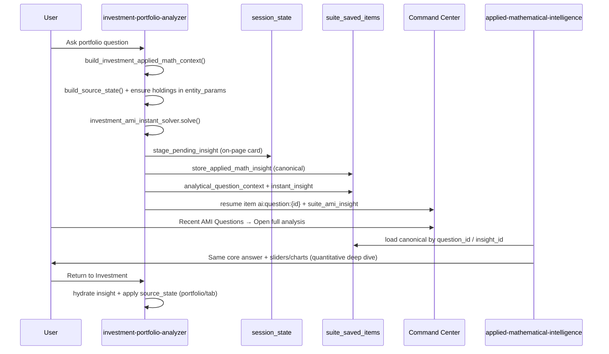

# Investment AMI Architecture Plan

**Status:** Planning kickoff (Phase 0)  
**Last updated:** 2026-06-17  
**Repo:** `investment-portfolio-analyzer`  
**Primary blueprint:** Baseball AMI (`baseball-stat-app`) — **not** Music AMI  
**Related:** Music canonical-insight milestone validated 2026-06-17

---

## 1. Milestone context

### Music AMI — validated

Recent cloud test (*"What songs would sound good on Guitar and are similar to Perfect?"*) confirmed:

- Correct intent routing (similar songs, not practice plan)
- Guitar-specific coaching language
- **Music app answer = AMI deep dive answer** (canonical insight flow)
- No generic fallback

Music philosophy going forward: **coach / teacher / practice guide** — not Baseball-style quantitative breakdown. Sliders only when they teach (key selector, transposition keys, tempo BPM).

### Investment AMI — next milestone

Investment should feel like **financial analyst + portfolio risk coach + educator** — closer to Baseball than Music.

> **Not personal financial advice.** Explain tradeoffs, risks, and scenarios; do not guarantee outcomes.

---

## 2. App philosophy comparison

| Dimension | Music | Baseball | Investment |
|-----------|-------|----------|------------|
| Primary mode | Coaching / teaching | Analyst / optimizer | Analyst / risk evaluator |
| Typical output | Practice guidance, theory, repertoire | Rankings, EV, projections | Exposure, concentration, scenarios |
| Sliders | Rare (educational only) | Common (assumptions, thresholds) | Common (risk, allocation, shocks) |
| Instant solver template | Local music solvers | `draft_ami_instant_solver.py` | **Build `investment_ami_instant_solver.py`** |
| Deep dive | Canonical coaching answer | Canonical + AMI re-solve parity | Canonical + quantitative AMI |
| Return behavior | Display-only (no time-travel) | Entity restore where needed | Portfolio/tab restore (existing `source_state`) |

**Do not clone Music AMI for Investment.** Reuse Music's **canonical insight storage pattern**, but use Baseball's **submit + instant solve + analyst framing** pattern.

---

## 3. Current state audit (Investment repo)

### Already in place

| Layer | Location | Notes |
|-------|----------|-------|
| Question submit | `suite_analytical_question.py` | Sidebar send, context blob, resume item |
| Context packaging | `applied_math_context.py` | Holdings, health score, weights, drift, macro, experience mode |
| Source state | `applied_math_context.build_source_state()` | Tab, holdings_df, fingerprint, filters |
| Return hydrate | `hydrate_investment_ami_return_state()` | AMI return + portfolio restore tests |
| AMI solvers (deep dive) | `applied-mathematical-intelligence` | rebalance, risk_return, concentration, macro_stress, drawdown_attribution |
| Insight card tests | `tests/test_investment_insight_card.py` | Hydrate from cloud |
| Command Center | `daniel-ai-command-center` | Recent AMI Questions (cross-app) |

### Gaps vs Baseball (priority)

| Gap | Baseball has | Investment needs |
|-----|--------------|------------------|
| **Instant on-page insight** | `draft_ami_instant_solver.py` + stage on submit | `investment_ami_instant_solver.py` |
| **Canonical insight storage** | `store_applied_math_insight` on submit | Same pattern (mirror Music v5 / Baseball) |
| **Deep-dive parity** | AMI loads canonical before re-solve | Extend AMI canonical path for `source_app=investment` |
| **Intent routing (local)** | `draft_ami_helpers` / intent detect | `investment_ami_context.py` intent map |
| **Inline insight render** | Renders card immediately after send | Wire `render_suite_applied_math_insight_for_page` |
| **Submit pipeline diagnostics** | `_ami_submit_pipeline` | Port for Investment dev mode |
| **Answer families (local)** | Draft, compare, trend, sleeper | Portfolio, overlap, valuation, allocation, scenario |

Investment currently sends questions to Command Center and relies on **AMI-only solve** — same pre-canonical Music failure mode.

---

## 4. Target architecture (Baseball blueprint)

### Shared suite contracts (reuse as-is)

- `build_question_payload` / `submit_analytical_question`
- `metrics_for_applied_math_resume` + `suite_ami_insight` in URL
- `instant_insight` in context blob
- `load_applied_math_insight_for_question`
- Command Center Recent AMI Questions (`ami_recent_dashboard.py`)

---

## 5. Investment AMI answer families

### Phase 1 families (instant + AMI routing)

| Family | Intent keys | Example questions | Context required |
|--------|-------------|-------------------|------------------|
| **portfolio_analysis** | concentration, diversification, health | "Is my portfolio too risky?" | holdings, weights, health_score, sectors |
| **etf_overlap** | overlap, duplicate exposure | "Should I own VOO and QQQ?" | holdings, overlap matrix (when available) |
| **valuation** | expensive, fairly valued, assumptions | "Is NVDA expensive?" | ticker, P/E, growth (when loaded) |
| **asset_allocation** | allocate, rebalance, bonds | "How should I allocate $10k?" | objective, risk_level, current weights |
| **scenario_stress** | what if, drop, rates rise | "What if tech falls 20%?" | sector weights, macro assumptions |
| **investment_coach** | explain, teach, what is | "What is concentration risk?" | experience_mode (beginner/advanced) |

### AMI repo alignment

Map local intents → existing AMI solvers in `applied_math_solvers.py`:

- `portfolio_analysis` / concentration → `solve_investment_concentration`
- `asset_allocation` / rebalance → `solve_investment_rebalance`
- `scenario_stress` / macro → `solve_investment_macro_stress`
- drawdown / stress attribution → `solve_investment_drawdown_attribution`
- risk/return → `solve_investment_risk_return`

Local instant solver produces **short direct answer**; AMI deep dive adds **sliders, tables, sensitivity**.

---

## 6. Beginner vs Advanced mode

Source: `experience_mode` / `investment_experience` already in context.

| Mode | Answer style |
|------|--------------|
| **Beginner** | Plain English, fewer metrics, define terms, "what this means for you" |
| **Advanced** | Metrics, factor exposure, scenario tables, assumption sensitivity |

Implementation:

- Pass `experience_mode` into instant solver and AMI context
- Template variants per family (not a separate routing tree)
- Beginner: hide Sharpe/beta jargon unless user asks
- Advanced: include concentration %, overlap %, sector weights, macro regime

---

## 7. Sliders and interactive controls (Investment)

Unlike Music, Investment **should** use controls when they change quantitative output:

| Family | Controls | Updates |
|--------|----------|---------|
| Asset allocation | equity %, bond %, cash % | recommended mix, drift |
| Scenario stress | tech drawdown %, rate shock bps | portfolio impact estimate |
| Valuation | growth rate, discount rate | fair value band / sensitivity |
| Rebalance | target drift threshold | trade list / priority |
| Risk | risk tolerance, time horizon | equity/bond guidance |

Pattern: mirror Baseball `render_solver_sections` + `_seed_control_defaults` in `applied_math_solver_ui.py`.

---

## 8. Proposed new modules (Investment repo)

| Module | Responsibility |
|--------|----------------|
| `investment_ami_context.py` | Intent detection, submit snapshot, experience mode |
| `investment_ami_instant_solver.py` | Local instant answers (Phase 1 families) |
| `investment_ami_intent.py` | Phrase → family mapping (optional split from context) |

Changes to existing files:

| File | Change |
|------|--------|
| `suite_analytical_question.py` | `_stage_investment_instant_insight()` + canonical submit (mirror Baseball/Music) |
| `applied_math_context.py` | Ensure overlap/sector fields in context when data available |
| `streamlit_app.py` | Hydrate + render insight card on relevant tabs |
| `applied_math_return_insight.py` | Investment-specific return (portfolio restore — already partially done) |

AMI repo:

| File | Change |
|------|--------|
| `applied_math_solver_ui.py` | Canonical investment insight before re-solve |
| `applied_math_return_insight.py` | `load_applied_math_insight_for_question` (already exists for Music) |

---

## 9. Phase plan

### Phase 0 — Planning & test matrix (this document)

- [x] Confirm Music canonical flow stable
- [ ] Define 10–15 Investment acceptance questions (see §10)
- [ ] Inventory which pages expose AMI sidebar today

### Phase 1 — Canonical instant insight (MVP)

**Goal:** On-page Investment insight + AMI deep dive agree (like Music milestone).

1. `investment_ami_instant_solver.py` — 3 families first:
   - portfolio_analysis (concentration)
   - asset_allocation (rebalance)
   - investment_coach (explain)
2. `_stage_investment_instant_insight` on submit
3. `store_applied_math_insight` + `instant_insight` in blob
4. AMI canonical render for `source_app=investment`
5. Tests: `tests/test_investment_instant_solver.py`, extend `test_investment_insight_card.py`

### Phase 2 — Full family coverage + sliders

1. etf_overlap, valuation, scenario_stress
2. Beginner/advanced answer templates
3. Interactive controls in AMI deep dive
4. Exposure/overlap charts where data exists

### Phase 3 — Polish & Command Center

1. Investment-specific Continue card copy
2. Recent AMI Questions filtering labels
3. Submit pipeline diagnostics in dev mode

### Deferred (unchanged)

- Music sync/persistence audit
- Investment workspace protocol (`prepare_investment_workspace`) — separate from AMI; see `cursor-prompts/plans/investment-sync-architecture-plan.md`

---

## 10. Acceptance test matrix (draft)

Run after Phase 1 deploy:

| # | Question | Page | Expect |
|---|----------|------|--------|
| 1 | Is my portfolio too concentrated? | Portfolio Health | Concentration analysis, not generic |
| 2 | Should I own both VOO and QQQ? | Holdings | Overlap / duplication framing |
| 3 | How should I allocate $10,000? | Portfolio Health | Allocation split with assumptions |
| 4 | What if tech drops 20%? | Macro / Health | Scenario impact on portfolio |
| 5 | What is diversification? | Any (beginner mode) | Plain-English coach answer |
| 6 | Open full analysis | CC → AMI | Same core answer as on-page card |
| 7 | Return to Investment | AMI link | Tab + holdings restored; insight visible |

---

## 11. Music backlog (do not block Investment)

- **Similar songs:** per-recommendation skill focus (not repeated generic blurbs)
  - Example: Photograph → arpeggios; Say You Won't Let Go → rhythm consistency
- **Theory/transposition:** optional educational sliders (key selector) — later
- **Answer family depth:** continue diverging coach voices per intent

---

## 12. Roadmap alignment

1. ✅ Music canonical insight stable (validated)
2. ⏳ A few more Music family tests (transposition, practice plan, theory)
3. **→ Investment AMI Phase 0/1 (this plan)**
4. Investment AMI Phase 2 (full families + sliders)
5. Music sync/persistence (deferred)
6. Multi-user / live draft rooms (deferred)

---

## 13. Reference implementations

| Pattern | Repo | Key files |
|---------|------|-----------|
| Instant solve + canonical store | `baseball-stat-app` | `draft_ami_instant_solver.py`, `suite_analytical_question.py` (~1527+) |
| Canonical AMI render | `applied-mathematical-intelligence` | `applied_math_solver_ui.py` (`_load_canonical_music_insight`) |
| Investment context | `investment-portfolio-analyzer` | `applied_math_context.py` |
| Investment AMI solvers | `applied-mathematical-intelligence` | `applied_math_solvers.py` (investment_* ) |
| Recent AMI history | `daniel-ai-command-center` | `ami_recent_dashboard.py` |
