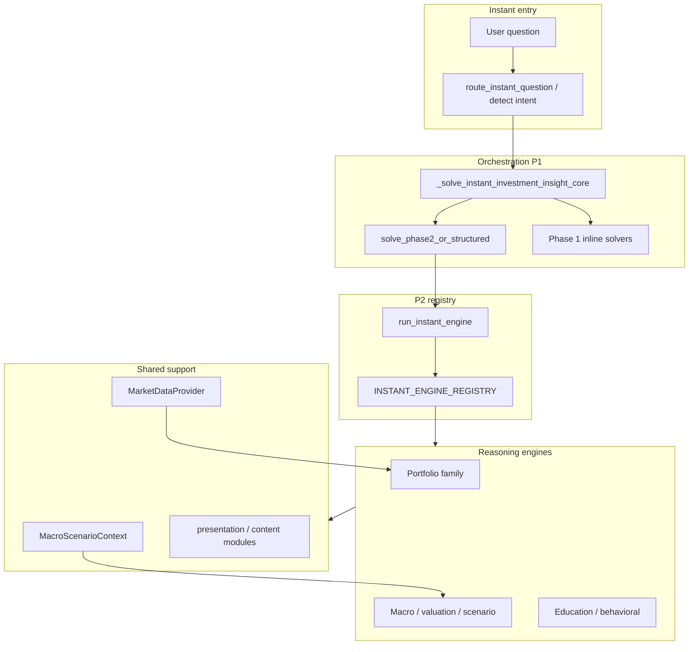

# Investment AMI engine architecture review (P2 complete)

**Date:** 2026-07-27  
**Status:** P2 engine extraction complete — intelligence expansion not started.

This review confirms registry routing, legacy retirement candidates, shared canonical layers, and follow-on work **without** changing runtime behavior.

---

## 1. Registry routing

All **Phase 2** instant families execute through ``investment_ami.pipeline.instant.run_instant_engine()`` and ``INSTANT_ENGINE_REGISTRY``:

| Registry key(s) | Engine module | Legacy intent(s) |
|-----------------|---------------|------------------|
| ``diversification`` | ``engines/diversification.py`` | ``diversification`` |
| ``portfolio_concentration``, ``portfolio_analysis`` | ``engines/portfolio_concentration.py`` | ``portfolio_concentration`` |
| ``portfolio_risk``, ``risk_analysis`` | ``engines/portfolio_risk.py`` | ``portfolio_risk`` |
| ``allocation_recommendation``, ``asset_allocation`` | ``engines/asset_allocation.py`` | ``allocation_recommendation`` |
| ``etf_overlap`` | ``engines/etf_overlap.py`` | ``etf_overlap`` |
| ``macro_rates``, ``macro_recession``, ``macro_inflation`` | ``engines/macroeconomic.py`` | macro intents |
| ``valuation`` | ``engines/valuation.py`` | ``valuation`` |
| ``scenario_stress`` | ``engines/scenario_stress.py`` | ``scenario_stress`` |
| ``education``, ``investment_coach`` | ``engines/education.py`` | ``investment_coach`` |
| ``behavioral_finance``, ``risk_reduction`` | ``engines/behavioral_finance.py`` | ``risk_reduction`` |

**Orchestration path:** ``solve_instant_investment_insight`` → facade → ``_solve_instant_investment_insight_core`` → ``solve_phase2_or_structured`` (for ``phase2_intents``) → ``run_instant_engine``.

**Phase 1 families still inline in ``investment_ami_instant_solver.py``** (not yet registry-backed):

| Intent | Legacy function | Notes |
|--------|-----------------|-------|
| ``rebalance_allocation`` | ``_rebalance_answer`` | Explain allocation / drift |
| ``sector_exposure`` | ``_tech_exposure_answer`` | Tech proxy from weights |

**Fallback duplicates (safe to retire later):** ``_concentration_answer``, ``_portfolio_risk_answer`` remain as fallbacks if phase-2 dispatch fails; primary path is registry.

Macro public wrappers in ``investment_ami_macro.py`` delegate to the registry.

---

## 2. Legacy code retirement candidates (do not delete yet)

| Location | What | When |
|----------|------|------|
| ``investment_ami_instant_solver._concentration_answer`` | Full concentration narrative | After phase-2 path proven-only in prod |
| ``investment_ami_instant_solver._portfolio_risk_answer`` | Full risk narrative | Same |
| ``investment_ami_phase2_solvers.structured_*`` | Thin wrappers | Keep for import stability |
| ``investment_ami_allocation.py`` / ``investment_ami_macro.py`` bodies | Solver logic + wrappers | Bodies still source of truth for allocation/macro math; engines call into them |

**Keep frozen:** ``investment_ami_context.py`` phrase routing, ``investment_market_data/`` (P0).

---

## 3. Duplicated calculations

**Consolidated (canonical):**

- Portfolio weights → ``_weight_rows`` / ``assess_portfolio_concentration`` / ``assess_portfolio_risk``
- Tech exposure → ``resolve_tech_exposure`` (``investment_ami_exposure``)
- Macro scenario → ``resolve_macro_scenario_context`` (``engines/support/macro_context.py``)
- Scenario stress snapshot → ``build_scenario_stress_snapshot``
- ETF overlap pairs → ``engines/support/overlap_data.py`` → ``MarketDataProvider`` / ``etf_holdings``
- Valuation context → ``resolve_valuation_context`` (uses macro context)

**Remaining overlap (acceptable for P2):**

- Phase 1 ``_tech_exposure_answer`` uses local tech ticker set vs ``resolve_tech_exposure`` in engines — **different code paths** until ``sector_exposure`` is migrated.
- Legacy concentration/risk fallbacks duplicate engine narratives — **intentional** safety net.

---

## 4. Canonical sources

| Concern | Canonical module |
|---------|------------------|
| Market data / holdings | ``investment_market_data`` (P0 — do not refactor) |
| Macro scenario | ``resolve_macro_scenario_context()`` |
| Valuation bands / labels | ``investment_ami_valuation`` (+ ``valuation_helpers`` re-exports) |
| Overlap | ``overlap_data`` + P0 provider |
| Educational disclaimers | ``presentation.default_educational_risk_notes`` |
| Coach copy | ``education_content`` |
| Risk-reduction / behavioral coaching copy | ``behavioral_finance_content`` |

---

## 5. Catalog and routing completeness

- Every ``legacy._INVESTMENT_SOLVER_INTENTS`` entry has a catalog row in ``catalog/generated_from_legacy.py``.
- Router wraps ``detect_investment_send_intent`` — single phrase source of truth.
- Catalog ``recommended_engines`` now lists ``behavioral_finance`` for ``risk_reduction`` (metadata alignment with registry).

**Gap:** ``sector_exposure`` and ``rebalance_allocation`` catalog entries reference engines that are not yet extracted modules.

---

## 6. Finalized engine architecture (diagram)

Package map: see ``docs/INVESTMENT_AMI_DECISION_ENGINE.md``.

---

## 7. Technical debt and future enhancements (not implemented)

1. **Extract ``SectorExposureEngine``** — unify ``_tech_exposure_answer`` with ``resolve_tech_exposure``; registry key e.g. ``sector_exposure``.
2. **Extract ``RebalanceExplanationEngine``** — move ``_rebalance_answer``; alias ``rebalance_allocation``.
3. **Remove duplicate fallbacks** — delete ``_concentration_answer`` / ``_portfolio_risk_answer`` once monitoring shows zero fallback use.
4. **Rich behavioral library** — loss aversion, recency bias, etc. as **new** content in ``behavioral_finance_content`` (wording TBD in intelligence phase).
5. **Multi-engine synthesis** — orchestrator above registry for personalized recommendations (post-P2 intelligence phase).
6. **Catalog engine names** — align ``scenario_analysis`` / ``macroeconomic`` labels with registry ids for tooling.
7. **Deep-dive AMI parity** — ensure cloud AMI solvers consume same context builders as instant engines.

---

## Test gate

Run the investment AMI battery (engine unit tests + ``test_investment_instant_solver`` + phase2 + submit/scenario paths) before any intelligence-phase changes.
