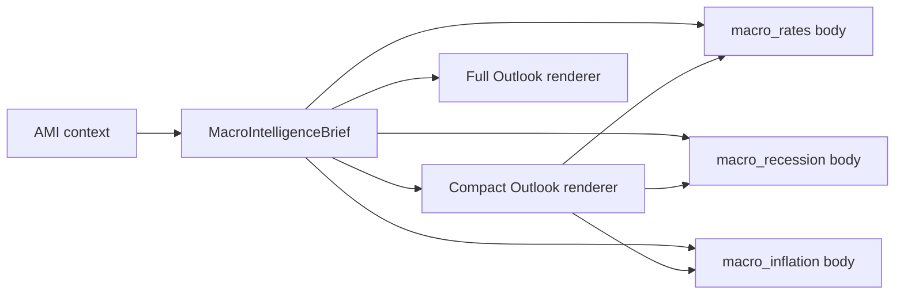
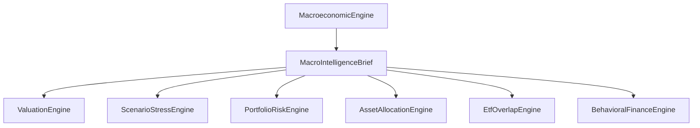

# Phase 3: Macroeconomic Intelligence — Design Document

**Status:** **Approved** for Phase 3.1 implementation (2026-07-27)  
**Implementation spec:** `INVESTMENT_AMI_MACRO_INTELLIGENCE_PHASE3_1_SPEC.md`
**Scope:** Intelligence enhancement only (P2 engine architecture is frozen unless a feature requires a minimal shared-data extension)  
**Primary engine:** `MacroeconomicEngine` (`macro_rates`, `macro_recession`, `macro_inflation`; optional future `macro_outlook`)  
**Shared foundation:** `MacroScenarioContext`, `portfolio_core.ForwardMacroAssumptions`, `allocation_profile_from_ctx`, existing shock models in `investment_ami_macro.py`

---

## Executive summary

Today, Investment AMI answers macro questions with **portfolio-weighted scenario math** tied to Portfolio Health assumptions (rate environment, inflation, recession probability, valuation, economic regime). That is useful but **reactive**: three intent-specific solvers, limited cross-engine consistency, and little “strategist” synthesis.

Phase 3 evolves MacroeconomicEngine from **scenario calculators** into a **macro reasoning layer** that:

1. Builds a structured **macro knowledge and state model** (concepts + user assumptions + optional live indicators).
2. Runs a repeatable **reasoning pipeline** (indicators → regime → asset-class channels → portfolio sensitivity → recommendations).
3. Publishes a **`MacroIntelligenceBrief`** consumed by Valuation, Scenario Stress, Portfolio Risk, Allocation, Overlap, and Behavioral engines.
4. Improves **decision support** (monitor / rebalance / defensive tilt / stress-test prompts) without pretending to predict markets.
5. Adapts **explanations** to beginner, intermediate, and advanced investors with an internal **Reasoning Trace** and user-visible Macro Outlook.

**Approved product model:** Macro Outlook is the **standard macro context** for all macro-related reasoning. One **`MacroIntelligenceBrief`** powers both **compact** (header) and **full** (future dashboard) presentations.

Phase 3.1 implementation is authorized per `INVESTMENT_AMI_MACRO_INTELLIGENCE_PHASE3_1_SPEC.md`. Phase 3.2+ require separate sign-off.

---

## Macro Outlook — canonical output schema (UX target)

Phase 3 introduces a **Macro Outlook** summary that AMI can show as a strategist card (instant insight header, Portfolio Health sidebar, or dedicated `macro_outlook` answer). The structure below is the **approved presentation shape**; copy is generated from `MacroIntelligenceBrief`, not hard-coded prose.

### Reference example (illustrative)

```
Macro Outlook

Overall Regime:
Moderately Restrictive

Key Drivers:
• Elevated interest rates
• Inflation moderating
• Stable employment

Primary Risks:
• Slower earnings growth
• Higher borrowing costs

Potential Opportunities:
• High-quality equities
• Investment-grade bonds

Confidence:
82%
```

This example reflects a **restrictive-but-not-crisis** environment: policy/rates still tight, inflation easing, labor holding up — consistent with a soft-landing narrative. Implementation must **derive** labels and bullets from assumptions (and optional indicators), not emit this text verbatim unless inputs match.

### Field definitions

| Field | Meaning | Derivation (reasoning pipeline) |
|-------|---------|----------------------------------|
| **Overall Regime** | One-line macro “stance” for investors | Synthesized label from rate environment + inflation setting + economic regime + optional curve/credit (e.g. *Moderately Restrictive*, *Late-Cycle Expansion*, *Recession Risk Elevated*). Maps to regime step in §2. |
| **Key Drivers** | 2–4 bullets: what is moving macro | Top active **channels** from Health + indicators (policy/rates, inflation trend, labor, growth, credit). Plain language; no ticker symbols. |
| **Primary Risks** | 2–4 bullets: what could hurt portfolios | Channel **downside** for typical balanced ETF investor; **personalized** when weights exist (e.g. add “long-duration bond sleeve” if `long_duration_bonds` elevated). |
| **Potential Opportunities** | 2–4 bullets: relative positioning themes | **Decision-support themes**, not buy signals — e.g. quality equity, IG bonds, cash optionality, shorter duration. Filter by what is *underrepresented* in user portfolio when weights available. |
| **Confidence** | 0–100% display | **Dynamic score** (§5.7, §7 R4): completeness of weights + assumption consistency + indicator freshness − concentration×adverse macro overlap. Cap and floor aligned with existing AMI confidence bands (e.g. 55 empty portfolio, 82 strong alignment). |

### Regime label vocabulary (controlled)

Use a **small enum** of strategist labels to avoid noisy prose:

| Label | Typical inputs |
|-------|----------------|
| Supportive / Accommodative | Falling or stable rates, low/moderate inflation, expansion |
| Neutral / Mixed | Stable rates, moderate inflation, mixed signals |
| Moderately Restrictive | Rising or high rates, inflation moderating, stable labor |
| Restrictive | High rate environment, tight financial conditions |
| Late-cycle / Slowing | Expansion + elevated recession prob or inverted curve |
| Recession stress | Recession regime or very high recession probability |
| Stagflation stress | High inflation + restrictive rates |
| Crisis / Liquidity stress | Credit crisis regime or credit indicator blowout |

Exact string chosen by **scoring** inputs; secondary label optional in advanced trace only.

### Presentation tiers (single source of truth)

All surfaces render from **`MacroIntelligenceBrief`** — no duplicate regime logic in solvers.

| Surface | When | What the user sees |
|---------|------|-------------------|
| **Compact Macro Outlook** | **Phase 3.1:** every `macro_rates`, `macro_recession`, `macro_inflation` answer | Header block: regime, 2–3 drivers, top risk, top opportunity, confidence — then the **intent-specific** body (existing shock math and narratives, enriched where approved) |
| **Full Macro Outlook** | **Future:** dedicated `macro_outlook` question (Phase 3.4+) | Full strategist dashboard: complete driver/risk/opportunity lists, portfolio sensitivity paragraph, expanded Reasoning Trace, cross-links to stress/valuation |
| **Cross-engine (Phase 3.2+)** | ValuationEngine, ScenarioStressEngine first | Read-only brief fields; no second Outlook builder |



### Relationship to existing macro intents

| Surface | Behavior |
|---------|----------|
| **`macro_rates` / `macro_recession` / `macro_inflation`** (Phase 3.1) | **Compact Macro Outlook header** + intent-specific answer below |
| **`macro_outlook` intent** (Phase 3.4+) | **Full** Outlook dashboard from the **same** brief |
| **Other engines** (Phase 3.2+) | Consume brief; do not rebuild Outlook |
| **`computed` metadata** | Serialized brief + trace keys for UI and tests |

### Experience mode rendering

| Mode | Macro Outlook |
|------|----------------|
| **Beginner** | Regime + 2 drivers + 1 risk + 1 opportunity + confidence; tooltip definitions |
| **Intermediate** | Full card as above |
| **Advanced** | Full card + assumption echo + channel scores + indicator dates (if used) |

### Disclaimers (always adjacent)

Macro Outlook is **educational decision support** based on user assumptions and simplified models — not a forecast, not personal financial advice, not a recommendation to buy or sell any security.

---

## 1. Macroeconomic knowledge model

AMI should treat macro as **interconnected drivers of asset prices and portfolio outcomes**, not as a checklist of headlines. Each concept below maps to **investor relevance**, **typical transmission channels**, and **linkage to existing platform constructs** where applicable.

### 1.1 Federal Reserve policy

**Why it matters:** Central banks set the short end of rates and signal the path of financial conditions. That affects discount rates (growth stocks), bond prices (duration), credit availability, and the USD.

**Investor lens:** “Is policy restrictive, neutral, or supportive?” and “Is the market priced for cuts/hikes?”

**Platform link:** `health_rate_env`, `rate_shock` / rate-rise parsing, `_rate_environment_effects`, rate-bump portfolio impacts.

### 1.2 Interest-rate regimes

**Why it matters:** The *level and direction* of rates matter more than a single headline. Falling vs rising vs persistently high rates change the reward for holding bonds, REITs, growth equity, and cash differently.

**Investor lens:** Duration risk in bond funds; opportunity cost of cash; headwinds for long-duration assets.

**Platform link:** Rising / Falling / Stable / High Rate Environment in Health; scaled coefficients in `rate_rise_portfolio_impacts`.

### 1.3 Inflation

**Why it matters:** Inflation erodes **real** returns, punishes nominal long bonds, affects Fed policy, and supports some real assets and short-duration cash in high-inflation episodes.

**Investor lens:** Purchasing power of savings; whether bond funds are “safe” in name only.

**Platform link:** `health_inflation`, `_inflation_effects`, inflation stress in `investment_ami_macro.py`.

### 1.4 Yield curve

**Why it matters:** Curve shape (e.g. 2s10s spread) signals growth/recession expectations, bank lending incentives, and term premium. Inversion is a classic **late-cycle warning**, not a timing tool.

**Investor lens:** Recession risk vs soft landing; why long bonds behave differently from cash.

**Platform link:** Not in instant path today; Phase 3 **optional indicator** feeding regime interpretation.

### 1.5 GDP growth

**Why it matters:** Aggregate growth drives corporate revenue and risk appetite. Slowing growth increases recession probability and cyclical equity risk.

**Investor lens:** Why “the economy” still affects a diversified ETF portfolio.

**Platform link:** Encoded in `economic_regime` (Expansion, Recession, etc.) and forward projection commentary in `portfolio_core`.

### 1.6 Employment

**Why it matters:** Labor market strength supports consumption and delays recession fears; weakening labor tends to precede earnings downgrades and policy pivots.

**Investor lens:** Connection between jobs data and portfolio drawdowns (indirect, through earnings and policy).

**Platform link:** Future indicator; narrative support for recession intent.

### 1.7 Consumer spending

**Why it matters:** ~70% of US GDP; drives cyclical sectors and broad equity earnings.

**Investor lens:** Why recession scenarios hit equity-heavy portfolios even without picking individual stocks.

**Platform link:** Recession / cyclical drag in recession impact model; regime narratives.

### 1.8 Housing

**Why it matters:** Rates affect mortgages and housing activity; housing wealth affects consumption. REIT and rate-sensitive sleeves overlap here.

**Investor lens:** Why REITs and rate shocks can move together.

**Platform link:** REIT sleeve in `allocation_profile`; rate and recession models already include REIT drag.

### 1.9 Credit markets

**Why it matters:** Tight credit spreads risk-on; widening spreads signal stress and correlate with equity drawdowns (`Credit Crisis` regime).

**Investor lens:** “Financial conditions” — when borrowing gets hard, risk assets suffer together.

**Platform link:** `Credit Crisis` in `_economic_regime_effects`; future spread proxy optional.

### 1.10 Corporate earnings

**Why it matters:** Long-run equity returns tie to earnings and multiples. Macro drives earnings cycles (recession = earnings shock).

**Investor lens:** Valuation is not just P/E — it’s earnings path × multiple.

**Platform link:** Recession equity earnings drag; valuation environment in Health; ValuationEngine.

### 1.11 Business cycle

**Why it matters:** Early / mid / late cycle favors different tilts (cyclical vs defensive). Regime is the **integrating concept** for many indicators.

**Investor lens:** Why the same portfolio can feel “right” in expansion and painful in contraction.

**Platform link:** `health_regime`, `_economic_regime_effects`, recession probability.

### 1.12 Liquidity

**Why it matters:** Market liquidity and funding stress amplify drawdowns; calm liquidity supports risk-taking.

**Investor lens:** Why volatility spikes feel “different” from slow grinds.

**Platform link:** Volatility multipliers in macro effects; optional VIX regime flag.

### 1.13 Commodity markets

**Why it matters:** Energy and materials affect inflation, margins, and real-asset sleeves.

**Investor lens:** Inflation shocks and commodity-linked exposure in broad funds.

**Platform link:** `real_assets` in inflation effects; optional commodity shock facet later.

### 1.14 Currency strength

**Why it matters:** USD strength affects multinational earnings, EM assets, and imported inflation.

**Investor lens:** International funds and FX — often hidden inside ETF holdings.

**Platform link:** Future; overlap with holdings geography when data exists.

### 1.15 Global growth

**Why it matters:** US portfolios have global revenue exposure; foreign slowdowns hit US multinationals and international ETFs.

**Investor lens:** Diversification is not immunity from global cycles.

**Platform link:** Future PMI / global growth indicators; narrative in recession/outlook.

### 1.16 Market volatility

**Why it matters:** Vol regime changes risk perception, correlations, and optimal defensive positioning (behavioral + risk engines).

**Investor lens:** Higher vol → same weights feel riskier; rebalancing bands matter more.

**Platform link:** `volatility` in context; PortfolioRiskEngine; vol multipliers in macro effects.

### 1.17 Knowledge model structure (design artifact)

Concepts roll up into a **`MacroKnowledgeGraph`** (conceptual, not necessarily a graph DB):

| Layer | Contents |
|-------|----------|
| **Primitives** | Policy, rates, inflation, growth, labor, credit, liquidity, vol |
| **Composite states** | Financial conditions tightness, inflation regime, business-cycle phase |
| **Asset channels** | Discount rate, duration, earnings, credit spread, inflation pass-through, liquidity |
| **Portfolio sensitivities** | Sleeve weights × channel exposures (from `allocation_profile`) |

The MacroeconomicEngine **does not need to expose all concepts in every answer**; it selects the **top 3 channels** relevant to the question and portfolio.

---

## 2. Macro reasoning framework

### 2.1 Pipeline (strategist flow)

```
Macro inputs (assumptions ± indicators)
        ↓
Normalize & validate (weights present?, assumptions consistent?)
        ↓
Interpret → Current economic regime view (labels + confidence)
        ↓
Transmit → Likely effects on asset classes (channels)
        ↓
Portfolio → Rank sensitivities for THIS portfolio
        ↓
Scenario quant (intent-specific shock models — existing math)
        ↓
Recommend → Decision-support actions (monitor / rebalance / stress / hold)
        ↓
Explain → Experience-mode narrative + reasoning trace
```

**Outputs:**

- **`MacroIntelligenceBrief`** — shared struct attached to context or computed metadata (extends `MacroScenarioContext`).
- **Intent-specific answer** — rates / recession / inflation narratives enriched by the same brief.

### 2.2 Regime interpretation (not a single slider)

Regime is a **view** synthesized from:

- User settings: `rate_environment`, `inflation`, `recession_probability`, `valuation`, `economic_regime`
- Optional indicators: curve, CPI trend, unemployment direction, credit proxy, VIX
- Question focus: rate question emphasizes policy/duration; recession emphasizes earnings/defensive; inflation emphasizes real returns

**Regime labels (examples):** Restrictive financial conditions · Disinflationary soft landing · Late-cycle expansion · Recession risk elevated · Stagflation stress · Risk-on liquidity

Labels are **heuristic summaries** for communication, backed by channel weights — not hidden ML in Phase 3.1.

### 2.3 Asset-class transmission

Each regime view maps to **expected directional pressure** (not point forecasts):

| Channel | Typical victims | Typical relative beneficiaries |
|---------|-----------------|-------------------------------|
| Discount rate ↑ | Long duration bonds, growth/tech, REITs | Cash, short duration, value tilt |
| Inflation ↑ | Long nominal bonds | T-bills, some real assets, shorter duration |
| Earnings ↓ | Cyclical equity, high beta | Quality/dividend, defensive bonds (context-dependent) |
| Credit stress | Equity, HY, REIT | Treasuries, cash (flight to quality) |
| Vol ↑ | Concentrated growth | Diversification, defensive sleeves |

Quantitative magnitudes continue to use **`portfolio_core` coefficients** and **`investment_ami_macro` impact functions** unless a approved Phase 3 change explicitly recalibrates them (with test updates).

### 2.4 Portfolio implications

Using `allocation_profile_from_ctx`:

1. **Rank channel exposures** (e.g. long-duration bond weight × rate channel).
2. **Surface concentration** (top sleeve amplifies macro shock — ties to concentration/risk engines).
3. **Identify hidden overlap** (e.g. QQQ + VOO + rate shock = growth + beta stack — ties to overlap engine).
4. **Compare to user objective** (`objective`, risk level) — macro adjusts **framing**, not goal substitution.

### 2.5 Conflicting signals

Conflicts are normal (e.g. user assumes Stable Rates while curve inverted; Expansion regime with high recession probability).

**Handling rules:**

| Situation | Behavior |
|-----------|----------|
| Assumption vs optional indicator disagree | State both; **prefer user assumptions for quant** unless user opts into “align with latest data”; lower **confidence** |
| Multiple channels push opposite ways | Present **net illustrative direction** from existing shock model + **explicit tradeoffs** (“bonds help inflation but hurt if rates rise further”) |
| Macro suggests “add bonds” but portfolio already bond-heavy | **Hold / monitor** recommendation; allocation engine resolves drift vs target |
| Missing weights | Skip quant; **monitor + educate**; confidence ≤ 55 (existing pattern) |
| Extreme recession prob + AI/Tech Boom regime | Flag **assumption tension** in reasoning trace; ask user to reconcile in Health settings |

**No silent overrides:** AMI must not change Health sliders automatically in Phase 3.

---

## 3. Integration with other engines

Shared artifact: **`MacroIntelligenceBrief`** (proposed fields below). Produced by MacroeconomicEngine (or `engines/support/macro_intelligence.py` after approval). Consumed read-only by other engines.

### 3.1 Proposed brief contents

| Field group | Examples | Purpose |
|-------------|----------|---------|
| **Context echo** | rate_env, inflation, regime, recession_prob, valuation_env | Consistency |
| **Regime view** | primary_label, secondary_labels[], label_confidence | Strategist voice |
| **Channel ranks** | top_channels[{id, score, plain_explanation}] | Portfolio-specific |
| **Assumption tensions** | [{assumption, conflict_with, severity}] | Conflicts |
| **Indicator snapshot** | optional, dated | Evidence layer |
| **Suggested stresses** | e.g. rate +2%, recession severity 1.0 | Cross-link ScenarioStressEngine |
| **Systematic risk flags** | e.g. duration_heavy, cyclical_heavy | PortfolioRiskEngine |
| **Narrative snippets** | beginner / intermediate / advanced one-liners | UX consistency |

### 3.2 ValuationEngine

**Share:** valuation_environment, discount-rate channel strength, earnings-cycle label, macro regime summary.

**Use:** Explain *why* “expensive” bites more under restrictive policy; align P/E/growth commentary with rate/inflation story.

**Do not:** Duplicate full valuation math inside macro engine.

### 3.3 ScenarioStressEngine

**Share:** rate_shock default, recession severity scale, suggested compound scenarios (macro-authored list).

**Use:** Macro answers recommend **which stress tests** matter; stress engine runs tech/rate/portfolio impact math.

**Do not:** Merge macro and tech shock into one solver without explicit product approval.

### 3.4 PortfolioRiskEngine

**Share:** systematic_risk_flags, vol_regime, channel ranks.

**Use:** Combine **idiosyncratic** (concentration, tech) with **systematic** (macro) in analyst view; optional combined confidence adjustment later.

**Do not:** Double-count tech exposure in macro and risk without clear division of labor (macro = environment; risk = portfolio structure).

### 3.5 AssetAllocationEngine

**Share:** regime-appropriate tilt guidance (defensive vs growth opportunity cost), tension with current weights.

**Use:** Macro conditions **condition** allocation recommendations (“in late cycle, drift toward growth increases drawdown risk”).

**Do not:** Issue target percentages without existing allocation logic and user targets.

### 3.6 EtfOverlapEngine

**Share:** macro-relevant overlap (e.g. multiple growth index funds under rate shock).

**Use:** When macro flags rate/growth channel, suggest overlap check if VOO+QQQ+MGK-style stack detected.

**Do not:** Recompute overlap inside macro engine — call overlap assessment or cite brief from overlap engine run.

### 3.7 BehavioralFinanceEngine

**Share:** vol regime, drawdown risk narrative, “uncertainty elevated” flags.

**Use:** Macro volatility / recession fear → decision-making reminders (recency, panic selling) **without** changing behavioral copy unless approved.

**Do not:** Moralize; keep educational tone.

### 3.3 Integration diagram



**Resolver:** `resolve_macro_intelligence(context)` → brief; falls back to `resolve_macro_scenario_context()` if brief not built (backward compatible).

---

## 4. Data strategy

Principle: **User assumptions remain authoritative** for portfolio math; **external data informs narrative, confidence, and tension detection** unless user opts in to sync.

### 4.1 Already available

| Data | Source | Use | Update | Reliability | Cache | Required? |
|------|--------|-----|--------|-------------|-------|-----------|
| Rate environment | `health_rate_env`, scenario | Rate channel, quant | Session | High (user-set) | N/A | **Required** for macro quant |
| Inflation setting | `health_inflation` | Inflation channel | Session | High | N/A | **Required** for inflation intent |
| Recession probability | `health_recession` | Recession framing | Session | High | N/A | Optional but default present |
| Valuation setting | `health_valuation` | Multiple/discount story | Session | High | N/A | Optional |
| Economic regime | `health_regime` | Cycle narrative | Session | High | N/A | Optional |
| Portfolio weights | `current_weights` | Sensitivity | Session | High when present | N/A | **Required** for portfolio-specific quant |
| Allocation profile | Derived via `etf_holdings` + core | Sleeve impacts | Per request | Medium–high | Memoize per context fingerprint | **Required** for quant |
| Macro summary string | `macro_assumption_summary()` | Caption echo | Session | High | N/A | Optional |
| Historical vol / health metrics | Context keys | Risk overlay | Session | Medium | N/A | Optional |
| Shock models | `portfolio_core`, `investment_ami_macro` | pp shifts | Code | Stable | N/A | **Required** for current intents |

### 4.2 Can realistically be added soon

Separate **`macro_indicators`** module (not P0 `investment_market_data` ETF provider — new boundary, cached public series):

| Indicator | Why useful | Frequency | Reliability | Cache | Required? |
|-----------|------------|-----------|-------------|-------|-----------|
| Fed funds / policy rate | Policy stance | Daily/ per FRED release | High | Yes, TTL 24h | Optional |
| 2Y, 10Y Treasury yields | Duration, curve | Daily | High | Yes, TTL 24h | Optional |
| 2s10s spread | Recession watch | Daily | High | Yes | Optional |
| CPI YoY (headline/core) | Inflation evidence vs assumption | Monthly | High | Yes, TTL 7d | Optional |
| Unemployment rate | Labor / cycle | Monthly | High | Yes, TTL 7d | Optional |
| HY OAS or proxy | Credit conditions | Daily | Medium | Yes, TTL 24h | Optional |
| VIX | Vol regime | Daily | Medium | Yes, TTL 1h | Optional |

**Cache policy:** File or JSON under `data/macro_indicators_cache/` (gitignored); stale cache → degrade to assumptions-only with confidence penalty.

**Failure mode:** Never block instant answer; omit indicator layer and note “live macro data unavailable.”

### 4.3 Future enhancements

| Data | Why | Notes |
|------|-----|-------|
| GDP nowcast, ISM PMI | Growth momentum | Monthly/quarterly |
| Earnings consensus revisions | Earnings cycle | Vendor/API cost |
| Housing starts, mortgage rates | Housing channel | Monthly |
| DXY, EM spreads | Global/FX | Daily |
| Fed funds futures / dot plot | Policy path | Complex; compliance copy |
| Commodity indices | Supply shocks | Daily |
| Historical analog matcher | “Similar to 2018 tightening” | Research feature; careful disclaimers |

---

## 5. Recommendation framework

Macro influences **decision support**, not market timing. Recommendations use a **verb taxonomy** aligned across engines:

| Verb | Meaning |
|------|---------|
| **Monitor** | Watch indicator or sleeve; no trade implied |
| **Hold** | Current mix acceptable given macro + goal |
| **Rebalance** | Drift vs target worsened by macro channel |
| **Reduce exposure** | Trim sleeve tied to dominant risk channel |
| **Add defensive** | Increase bonds/cash/dividend *if* underweight vs plan |
| **Stress-test** | Run ScenarioStressEngine scenario |
| **Review overlap** | Run EtfOverlapEngine when macro stacks growth/rate risk |
| **Revisit assumptions** | Health settings conflict with evidence |

### 5.1 Buy decisions

Macro should **not** say “buy X now.” It should frame:

- Whether **adding risk** (equity/growth) has **higher opportunity cost** in restrictive conditions.
- Whether **new cash** favors **short duration / diversification** before single-theme ETFs.
- **Valuation + rates** joint headwind for long-duration growth.

### 5.2 Hold decisions

Hold when:

- Defensive sleeves already align with macro channels.
- Macro shock is **illustrative**, not breach of user risk tolerance.
- Conflicting signals → hold + monitor is default.

### 5.3 Rebalancing

Trigger language when:

- Macro amplifies **existing drift** (e.g. growth sleeve grew in late cycle).
- Rate channel + overweight long-duration bonds vs objective.

AssetAllocationEngine owns **target vs current**; macro supplies **why now matters**.

### 5.4 Cash allocation

T-bills/cash channel lifts in rising rates / high inflation narratives; macro explains **role of cash** (optionality, not market timing).

### 5.5 Sector tilts

Express as **sleeve-level** (tech/growth proxy, dividend, REIT) — consistent with ETF portfolio model, not stock picking.

### 5.6 Geographic diversification

Phase 3 narrative only unless international weights detected; future data on FX/global growth.

### 5.7 Risk management

Primary Phase 3 win: tie macro to **ScenarioStressEngine** and **BehavioralFinanceEngine** (vol regime, drawdown preparedness) and **PortfolioRiskEngine** (concentration × macro).

**Confidence scoring (design):**

- Base from data completeness (weights, assumptions).
- Penalties: assumption conflicts, stale indicators, high concentration + adverse macro channel.
- Never claim precision beyond model (educational disclaimers preserved).

---

## 6. User experience

### 6.1 Experience modes

| Element | Beginner | Intermediate | Advanced |
|---------|----------|--------------|----------|
| Headline | One plain sentence + one portfolio fact | Headline + 3 mechanism bullets | Headline + decomposition table |
| Jargon | Define duration, inflation, recession | Use terms with short gloss | Full pp component breakdown |
| Numbers | At most one illustrative pp | Key variables block | All components + multipliers |
| Actions | One next step (stress question or Health review) | 2–3 tiered actions | Actions + cross-engine prompts |
| Fed/curve | “Higher rates make borrowing costlier; bond funds can fall” | “Restrictive policy → duration risk” | Spread, channel math, assumption echo |

### 6.2 Reasoning Trace (internal canonical structure)

Every macro solve builds a **`MacroReasoningTrace`** inside `MacroIntelligenceBrief`. It is the **single source of truth** for “why AMI said this.”

| Trace section | Contents |
|---------------|----------|
| **Economic regime** | Overall regime label + 1-sentence justification tied to Health assumptions |
| **Supporting evidence** | List of assumption keys used (`health_rate_env`, `health_inflation`, `health_regime`, `health_recession`, `health_valuation`); Phase 3.1 evidence is **assumption-based only** (no external indicator series) |
| **Key drivers** | 2–4 driver bullets (same semantics as Outlook drivers) |
| **Primary risks** | 2–4 risk bullets; portfolio-aware when weights present |
| **Opportunities** | 2–4 opportunity themes (decision support, not buy calls) |
| **Recommendation drivers** | Verb-level drivers (monitor, hold, rebalance, stress-test, revisit assumptions) linking macro channels to suggested next steps for **this** intent |
| **Final macro conclusion** | One strategist sentence synthesizing regime + dominant portfolio channel + intent focus |

**User visibility by mode:**

| Mode | Trace exposure |
|------|----------------|
| Beginner | Final conclusion + regime in plain language; full trace in `computed` only |
| Intermediate | Collapsible “Why AMI said this” with drivers, risks, conclusion |
| Advanced | Full trace in analyst sections + assumption echo |

Compact Outlook header is a **rendering subset** of the brief; full Outlook dashboard (future) renders **all** trace sections plus portfolio sensitivity.

Legacy five-step “why” list is superseded by this trace schema for macro answers.

### 6.3 Strategist tone

Voice: experienced allocator explaining **tradeoffs**, not cheerleading or fear-mongering. Align with existing `build_analyst_sections` structure (direct answer, analyst view, tradeoffs, what-if, recommended actions, risk notes).

---

## 7. Future roadmap

Ordered by dependency and value; each item requires separate approval and tests.

| ID | Enhancement | Description |
|----|-------------|-------------|
| **R1** | Economic regime detection | Combine assumptions + indicators into stable regime labels with confidence |
| **R2** | Probability-weighted scenarios | Weight recession/rate/inflation shocks by `recession_probability` and regime |
| **R3** | Historical analogs | “Periods with similar curve + inflation” — narrative only, strong disclaimers |
| **R4** | Dynamic confidence scoring | Shared function across engines using brief completeness and tensions |
| **R5** | Cross-engine reasoning | Single “macro outlook for my portfolio” answer pulling brief + risk + allocation snippets |
| **R6** | Personalized macro recommendations | Tie to `objective`, experience mode, and Health score — still not advice |
| **R7** | Compound scenario library | Macro-defined multi-factor stresses consumed by ScenarioStressEngine |
| **R8** | Indicator sync opt-in | Button: “Update Health assumptions from latest indicators” |
| **R9** | Cloud AMI parity | Same brief in deep-dive AMI solvers |
| **R10** | Sector/geographic expansion | Holdings-level macro when data allows |

### 7.1 Approved implementation phases

| Phase | Deliverable | Approved scope |
|-------|-------------|----------------|
| **3.1** | `MacroIntelligenceBrief` + Reasoning Trace + **compact Macro Outlook header** on all three macro intents | Improved reasoning from **Health assumptions + allocation profile** only; **no** `portfolio_core` coefficient recalibration; **no** new external indicator feeds; standardized Outlook in first release |
| **3.2** | Cross-engine brief consumption | **ValuationEngine** and **ScenarioStressEngine** first (read-only); then risk, allocation, overlap, behavioral |
| **3.3** | Optional `macro_indicators` cache + assumption/evidence tension | Separate approval |
| **3.4** | `macro_outlook` intent + **full** Outlook dashboard | Same brief, full renderer |
| **3.5** | R2, R4, R7 probability/compound scenarios | Separate approval |

### 7.2 Non-goals (Phase 3)

- Replacing Portfolio Health sliders with black-box ML forecasts.
- Stock-level macro calls or crypto/individual name picks.
- Refactoring P0 MarketDataProvider for macro series.
- Removing backward-compatible macro intents or changing routing without migration plan.

### 7.3 Acceptance criteria (when implementation starts)

- Existing investment AMI tests pass until intentionally updated for approved copy/intelligence changes.
- New unit tests for brief builder, conflict handling, and channel ranking.
- Golden-string tests for beginner/advanced snippets where wording is frozen.
- Documentation update in `INVESTMENT_AMI_DECISION_ENGINE.md` linking to this doc.

---

## Approval record (2026-07-27)

| Decision | Status |
|----------|--------|
| Macro Outlook card schema | **Approved** |
| Macro Outlook as **standard context** for all macro reasoning | **Approved** |
| Phase 3.1: **compact Outlook header** on `macro_rates`, `macro_recession`, `macro_inflation` | **Approved** |
| Future `macro_outlook` → **full** dashboard; same `MacroIntelligenceBrief` | **Approved** |
| Phase 3.1: reasoning + brief; **no** large external indicator program | **Approved** |
| Phase 3.1: **no** recommendation coefficient recalibration | **Approved** |
| Cross-engine consumption starts **Phase 3.2** (Valuation + Scenario Stress first) | **Approved** |
| Internal **Reasoning Trace** schema (§6.2) | **Approved** |

---

*Related documents:* `INVESTMENT_AMI_MACRO_INTELLIGENCE_PHASE3_1_SPEC.md`, `INVESTMENT_AMI_DECISION_ENGINE.md`, `INVESTMENT_AMI_ENGINE_ARCHITECTURE_REVIEW.md`, `INVESTMENT_MARKET_DATA.md`
